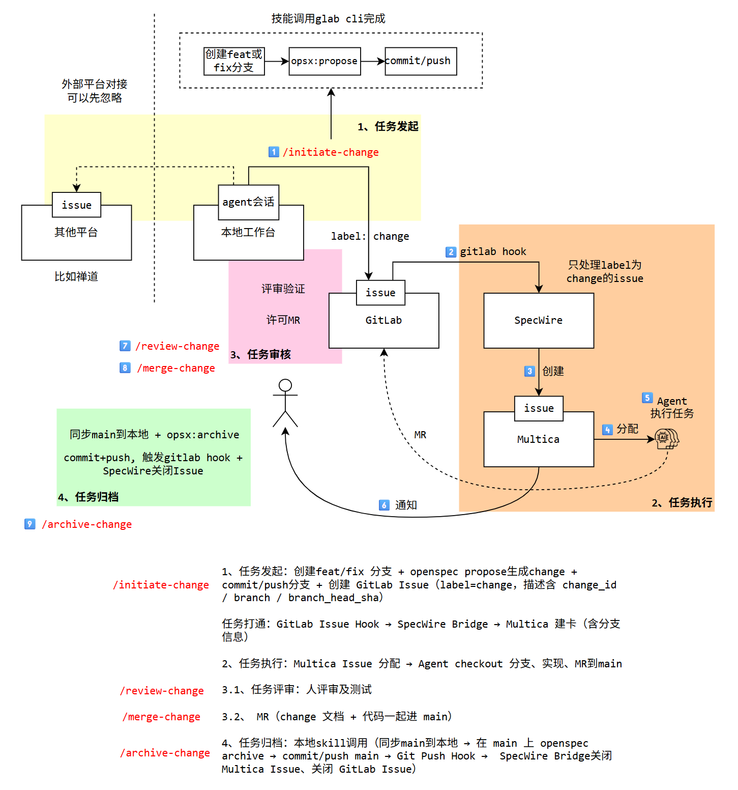

# SpecWire Integration Context

SpecWire is the integration boundary between GitLab's change lifecycle and Multica. Other execution systems are future integration targets, not current supported targets. It connects systems while keeping SpecWire Skills and the internal ownership of each system outside the SpecWire runtime boundary.

## Language

**SpecWire**:
The system-to-system integration layer that translates GitLab change events into execution-system projections and preserves the links needed for lifecycle closure.
_Avoid_: workflow product, agent runtime, project-management platform

**SpecWire Skill**:
An independently managed client-side automation capability that orchestrates repository, GitLab, or execution-system operations around SpecWire. SpecWire Skills are clients of SpecWire, not part of its runtime.
_Avoid_: SpecWire feature, Bridge behavior

**Execution System**:
A system that owns execution tasks and agent runs for a published change. Multica is the current execution system; other systems are future integration targets.
_Avoid_: SpecWire, source of truth

**Execution Projection**:
The derived representation of a published GitLab change in an execution system. It carries operational context and state but is not authoritative for the change content.
_Avoid_: specification, source change

**Execution Adapter**:
The narrow, pre-deployed integration boundary through which SpecWire addresses an execution system: resolve its project, create a projection, apply initial assignment or state, and mark the projection complete.
_Avoid_: workflow engine, full Multica model

**Publication**:
An immutable handoff of one change revision from GitLab into SpecWire through a GitLab Issue carrying the `change` label. Re-delivery of the same publication is idempotent; changing the frozen revision is a different change and is not an in-place task update.
_Avoid_: mutable task update, live branch tracking

**Archive Event**:
The GitLab push event that signals a merged change has been archived on `main`. It closes the execution projection and its publication Issue; it is a completion signal, not a publication entry point.
_Avoid_: v1 publication, proposal event

**Projection Recovery**:
The process of observing, retrying, or manually replaying a failed integration side effect without changing the authoritative GitLab change.
_Avoid_: rollback of source change, exactly-once execution

**Control Plane**:
The Workspace-scoped operational surface for keeping SpecWire integrations configured and observable, including accounts and memberships, login providers, provider endpoint profiles, connector type/behavior definitions, Group-scoped credentials, Connection and project/resource provisioning, webhook lifecycle, audit, and health. It owns the GitLab-to-Multica integration control plane but not local workflow Skills, Agent execution, review/merge decisions, or runtime checkout credentials.
_Avoid_: workflow UI, project-management system

**Workspace**:
The isolation and authorization boundary for SpecWire control-plane records. Accounts may belong to multiple Workspaces, while provider endpoint profiles, credentials, Connections, resources, operations, and audit records belong to exactly one Workspace.
_Avoid_: Multica Workspace, GitLab Group

**Identity Provider**:
A local or external OAuth/OIDC login source used to identify SpecWire accounts. It is separate from GitLab/Multica provider endpoint profiles and does not supply runtime provider credentials implicitly.
_Avoid_: GitLab instance, Group credential

**Provider Endpoint Profile**:
A Workspace-owned GitLab or Multica control-plane endpoint/profile with a stable internal instance ID. A Multica profile may be registered without a management credential; optional management access is capability-specific. The same physical endpoint may be registered independently in more than one Workspace with separate credential references. In a Flow, this profile is referenced by node parameters; it is not a Flow-level ConnectorNode instance.
_Avoid_: shared global credential, login provider, Flow connector instance

**Group Credential**:
A Workspace-owned GitLab access credential bound to a Group and, optionally, its subgroups. It is used for project discovery and authorized control-plane operations; it is not a login identity or runtime checkout credential.
_Avoid_: user login token, global PAT, runtime `glab` credential

**Provider Capability Check**:
A server-side check that a configured endpoint and credential reference can perform a requested integration operation. It describes provider access for the Workspace configuration, not the logged-in account's provider membership.
_Avoid_: per-user provider impersonation, Workspace membership

**Connection**:
The Workspace-scoped, instance-aware one-to-one binding between a GitLab source project and a Multica target project, including their provider endpoint, external workspace/project IDs, managed resources, shared Hook, and Flow collection.
_Avoid_: path-only project map

**ConnectorType**:
A registered provider family, such as GitLab or Multica, that groups supported ConnectorBehaviors and their adapter boundary.
_Avoid_: a configured project mapping, a Flow node instance

**ConnectorBehavior**:
A versioned input or output capability exposed by a ConnectorType, such as GitLab Issue Hook, GitLab Push Hook, Multica Create Issue, or Multica Complete Issue. It declares its direction, parameters, data contracts, capabilities, and execution boundary, which must be provided by a pre-deployed and approved adapter.
_Avoid_: arbitrary user code, a complete Flow

**ConnectorNode**:
A Flow-level use of one ConnectorBehavior with parameter bindings. It is not a reusable connector instance and does not own a separate Workspace or credential boundary.
_Avoid_: provider endpoint profile, custom code node

**DataModel**:
A declarative, versioned data contract carried between Flow node ports. It describes structure, required fields, types, extensions, and platform semantic roles; it is not necessarily a visible canvas node.
_Avoid_: raw provider payload, OpenSpec content

**Integration Flow**:
A Connection-scoped, versioned directed graph that receives an input ConnectorBehavior event, applies registered processing nodes and DataModel contracts, and invokes output ConnectorBehaviors. The first version is an acyclic, constrained integration graph rather than a general workflow engine.
_Avoid_: approval workflow, local Skill orchestration, Agent runtime

**Runtime GitLab Access**:
The `glab`/checkout credential used by the Multica runtime or Agent environment. It remains outside SpecWire's connector credential boundary; SpecWire may report readiness but does not acquire or store it.
_Avoid_: login OAuth token, SpecWire Group credential

## Reference scenario

The end-to-end scenario in the project diagram is a client workflow around SpecWire, not an expansion of the SpecWire runtime boundary:

1. A locally managed Skill starts a change in an agent session/worktree: it creates a `feat`/`fix` branch, runs `opsx:propose`, commits and pushes the branch, then opens a GitLab Issue with the `change` label and the `change_id`, `branch`, and `branch_head_sha` fields.
2. The GitLab Issue Hook delivers that publication to SpecWire. SpecWire validates the event, creates the Multica execution projection with the branch context, and applies the requested initial status or assignment. Other issue platforms are outside the current supported target.
3. Multica and the client Agent handle checkout, implementation, MR delivery, human review, and merge. These are client/execution-system responsibilities, not SpecWire Bridge behavior.
4. The archive Skill synchronizes the merged `main`, runs the repository's archive operation, and pushes the archive event. SpecWire receives the `archived` Push Hook, completes the Multica projection, and closes the linked GitLab publication Issue.

The diagram's `label: change` wording means that the GitLab Issue carries the `change` label. In the canonical GitLab protocol, this is an Issue label (`labels[].title == "change"`), not a Git tag or a generic webhook field. The diagram is a scenario reference and does not make the local Skills, Agent session, review, merge, notification, or archive command part of SpecWire's runtime contract.
